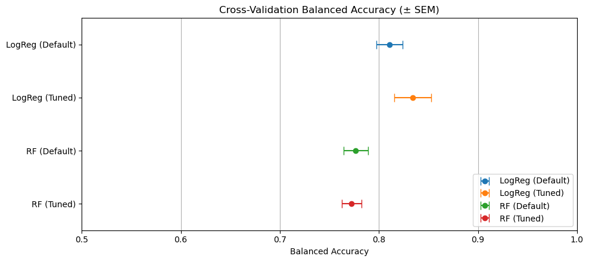
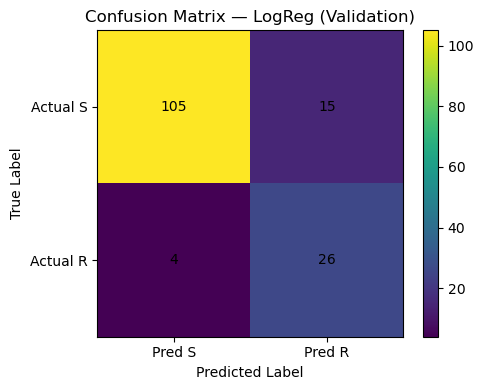
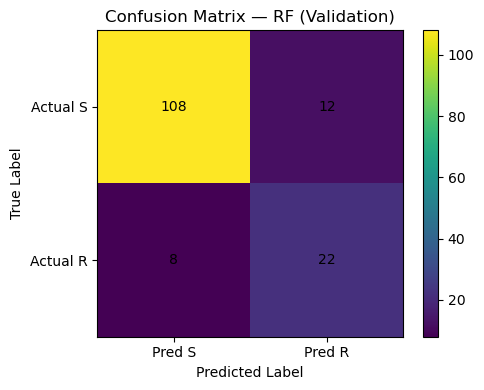

# Exploring the Bacterial Genome using Data Science

> Predicting antibiotic resistance in *E. coli* using machine learning on genomic features.

  

---

## Overview

This project uses **gene presence/absence matrices** and **k-mer counts** from bacterial genomes to predict resistance to the antibiotic **cefepime** in *Escherichia coli*. Two models were built, tuned, and compared using rigorous nested cross-validation.

**Final Model: Logistic Regression**
Selected for its strong recall on resistant isolates and interpretable feature coefficients.

---

## Data Files

```
train_test_data/

├── train_pa_genes.csv          #Training gene presence/absence matrix
├── test_pa_genes.csv           #Test gene presence/absence matrix
├── train_genes.csv             #Training gene alignment metadata
├── test_genes.csv              #Test gene alignment metadata
├── train_kmers.npy             #Training k-mer feature arrays
├── test_kmers.npy              #Test k-mer feature arrays
├── train_ids.npy               #Training genome IDs
├── test_ids.npy                #Test genome IDs
├── y_train.npy                 #Resistance labels (R / S)
└── kmer_data_column_genes.npy
```

---

## Methods

### Features & Labels
| Type | Description |
|------|-------------|
| Gene matrix | Presence/absence of genes across genomes |
| K-mer counts | Fixed-length sequence fragment frequencies |
| Labels | Resistant (R) or Susceptible (S) to cefepime |

### Models
| Model | Tuning Strategy |
|-------|----------------|
| Logistic Regression | `liblinear` solver · GridSearch over C ∈ {0.01–100} · L1/L2 penalty |
| Random Forest | GridSearch over n_estimators, max_depth, min_samples |

### Evaluation Pipeline
```
Nested Cross-Validation
├── Outer CV  →  5-fold StratifiedKFold  (generalization estimate)
└── Inner CV  →  3-fold GridSearchCV     (hyperparameter tuning)

Primary metric   : Balanced Accuracy
Secondary metrics: Recall · Confusion Matrix · Classification Report
Final comparison : 20% stratified holdout split
```

---

## Results

Logistic Regression outperformed Random Forest on the metrics that matter most for AMR prediction:

- **Higher recall on resistant isolates** — correctly identified 87% of resistant cases vs 73% for Random Forest
- **Fewer missed resistant cases** — only 4 false negatives vs 8 for Random Forest
- **Interpretable** top predictive genes via logistic coefficients



---

## Model Comparisons

| Logistic Regression | Random Forest |
|---|---|
|  |  |


## Requirements

```bash
pip install numpy pandas matplotlib scikit-learn scipy
```

---

## Usage

1. Clone the repo and open the notebook:
```bash
jupyter notebook Exploring_the_Bacterial_Genome_using_Data_Science.ipynb
```

2. Update the data path in `load_data()`:
```python
load_data(data_dir='/path/to/your/train_test_data')
```

---

## Author

**Ryan Kelly**

Built as part of the **[Build Fellowship](https://www.buildfellowship.com)**

[](https://github.com/ryankellyongh)
